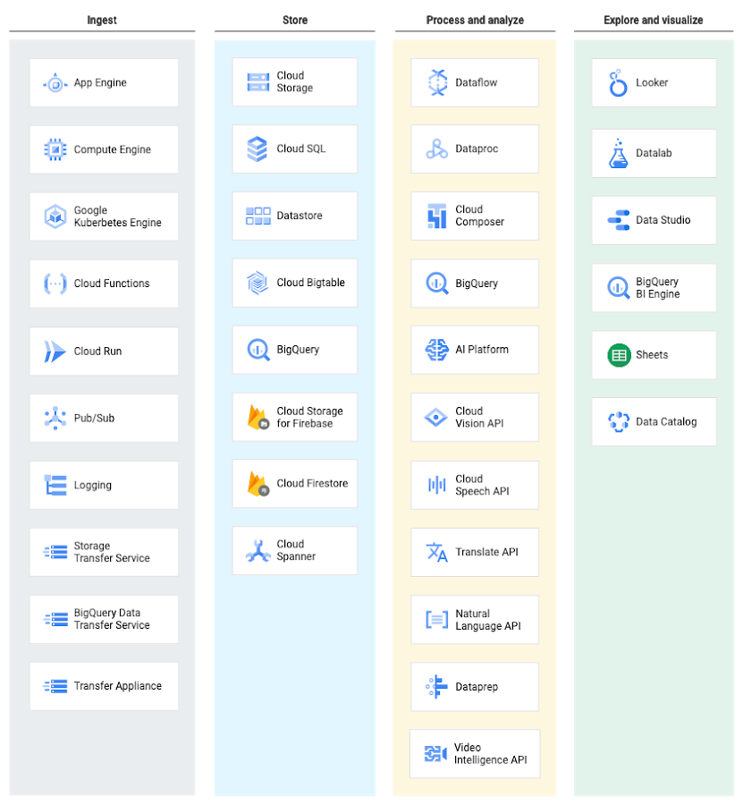

# Data Engineering Zoomcamp Practice

Thanks very much to [**DataTalksClub**](https://github.com/DataTalksClub)!

## Other participants's repo:
- [jxareas](https://github.com/jxareas/de-zoomcamp-2024)
- [Yokanisha](https://github.com/Yokanisha/DataZoomCamp2024)
- [nnphuyen563](https://github.com/nnphuyen563/DE-Zoomcamp-2024)
- [sf-pear](https://github.com/sf-pear/data-engineering)
- [rebekamukherjee](https://github.com/rebekamukherjee/data-engineering-zoomcamp)
- [10Kang](https://github.com/10Kang/DE_Zoomcamp2024_ZY)
- [gdq12](https://github.com/gdq12/data-engineering-zoomcamp-2024)
- [iobruno](https://github.com/iobruno/data-engineering-zoomcamp)
- [Zhe-YAN-Berlin](https://github.com/Zhe-YAN-Berlin/Data_Eden)

## The dataset:
[Trip record the user guide](https://www.nyc.gov/assets/tlc/downloads/pdf/trip_record_user_guide.pdf)

The data set is divided into 4 parts:

- Yellow cabs
- Green cabs
- For Hire Vehicles
- High volume for hire vehicles

Below I am only concentrating on Yellow and green cabs

### Yellow and green cabs:

| Columns               | Definition | Example             |
| --------------------- | ---------- | ------------------- |
| VendorID              |            | 2                   |
| lpep_pickup_datetime  |            | 2021-01-01 00:15:56 |
| lpep_dropoff_datetime |            | 2021-01-01 00:19:52 |
| store_and_fwd_flag    |            | N                   |
| RatecodeID            |            | 1                   |
| PULocationID          |            | 43                  |
| DOLocationID          |            | 151                 |
| passenger_count       |            | 1                   |
| trip_distance         |            | 1.01                |
| fare_amount           |            | 5.5                 |
| extra                 |            | 0.5                 |
| mta_tax               |            | 0.5                 |
| tip_amount            |            | 0                   |
| tolls_amount          |            | 0                   |
| ehail_fee             |            |                     |
| improvement_surcharge |            | 0.3                 |
| total_amount          |            | 6.8                 |
| payment_type          |            | 2                   |
| trip_type             |            | 1                   |
| congestion_surcharge  |            | 0                   |

### Taxi zone Loopup:

| Columns      | Definition | Example        |
| ------------ | ---------- | -------------- |
| LocationID   |            | 1              |
| Borough      |            | EWR            |
| Zone         |            | Newark Airport |
| service_zone |            | EWR            |

Source data here:
# NYC TLC Data 

Backup for NYC TLC data for the [DE Zoomcamp course](https://github.com/DataTalksClub/data-engineering-zoomcamp/)

CSV data:

* Yellow taxi data: https://github.com/DataTalksClub/nyc-tlc-data/releases/tag/yellow
* Green taxi data: https://github.com/DataTalksClub/nyc-tlc-data/releases/tag/green
* For-hire vehicles (FHV): https://github.com/DataTalksClub/nyc-tlc-data/releases/tag/fhv
* For-hire vehicles high volume (FHVHV): https://github.com/DataTalksClub/nyc-tlc-data/releases/tag/fhvhv
* Misc (zone lookup file): https://github.com/DataTalksClub/nyc-tlc-data/releases/tag/misc

The data was copied from the [NYC TLC website](https://www1.nyc.gov/site/tlc/about/tlc-trip-record-data.page)

## GCP service summary

# References
