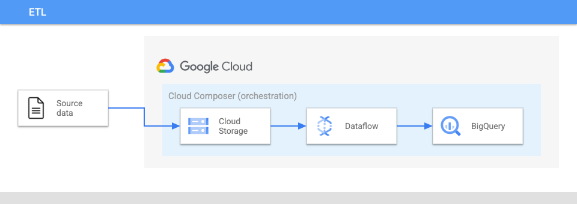

# Introduction

ETL Pipeline is an architecture for running batch data processing pipelines using the extract, transform, load method. This architecture consists of the following components:

- **Google Cloud Storage** for landing source data
- **Dataflow for performing** transformations on the source data
- **BigQuery as a destination** for the transformed data
- **Cloud Composer** environment for orchestrating the ETL process