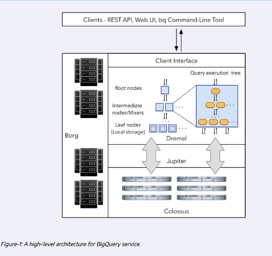
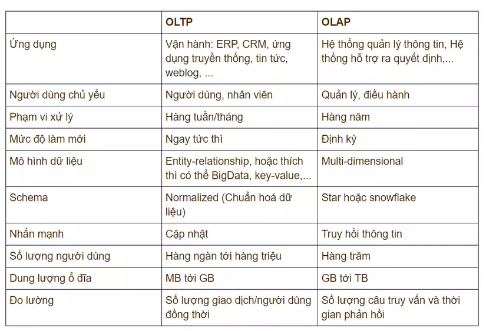
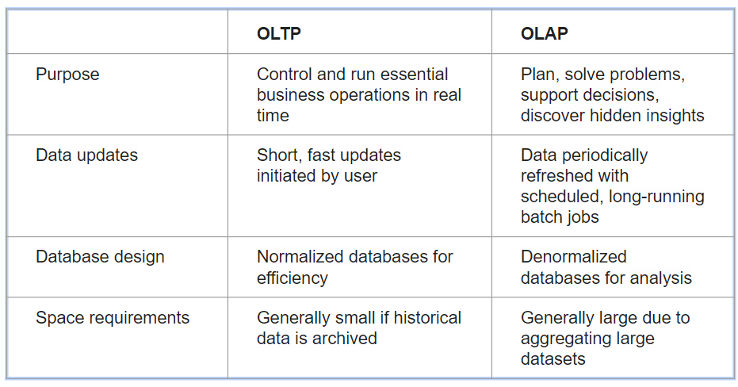
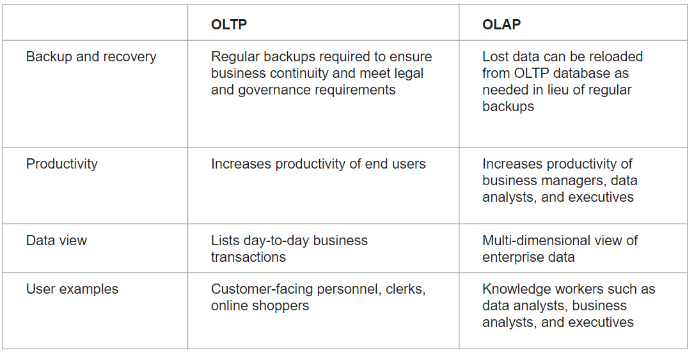
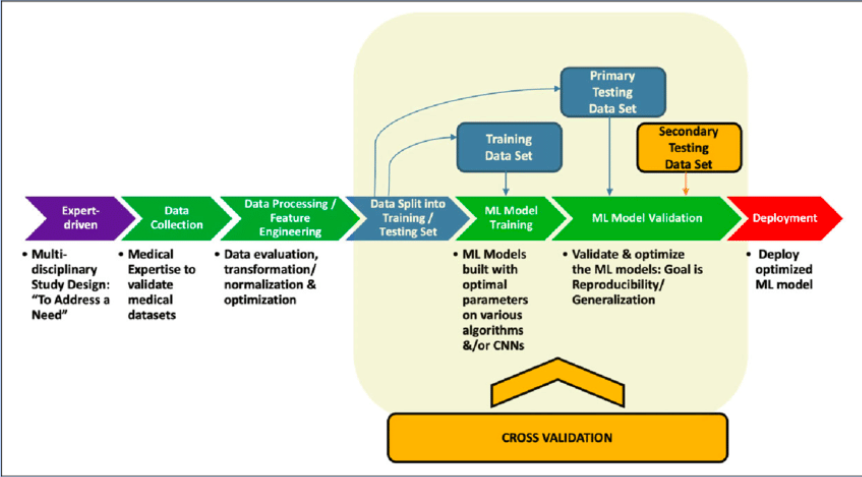

# Introduction
This course use Google BigQuery as a Data Warehouse.

# Structure Internal 

- [Slides](https://docs.google.com/presentation/d/1a3ZoBAXFk8-EhUsd7rAZd-5p_HpltkzSeujjRGB2TAI/edit#slide=id.p)

## OLTP vs OLAP

### **vi**

### **en**

## BigQuery-Best Practice
- Cost reduction
  - Avoid SELECT *
  - Price your queries before running them
  - Use clustered or partitioned tables
  - Materialize query results in stages

- Query Performance
  - Filter on partitioned columns
  - Denormalizing data
  - Reduce data before using a JOIN
  - Do not treat WITH clauses as prepared statement
  - Order Last, for query operations to maximize performance
  - [**JOIN**] As a best practice, place the table with the largest number of rows first, followed by the table with the fewest rows, and then place the remaining tables by decreasing size.
  
## ML in BigQuery
- No need to export data into a different system
- Free
  - 10 GB per month of data storage
  - 1 TB per month of queries processed
  

### Example

